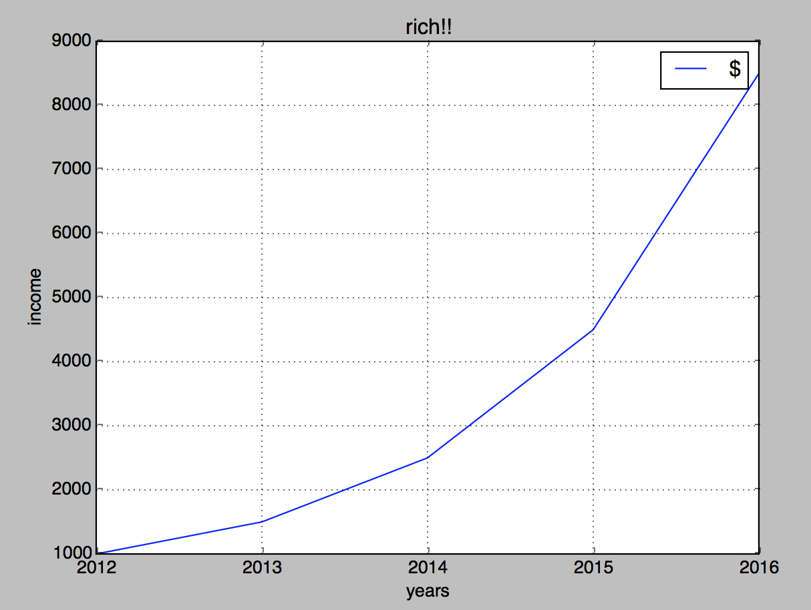

# Explot

Explot helps you plot your Elixir data using Python's Matplotlib.

This package does not try to redo Matplotlib (have you seen how big is that thing?) but lets Elixir interface
with Matplotlib to plot the data.

## Installation

```elixir
def deps do
  [{:explot, "~> 0.1.0"}]
end
```

Explot needs your system to have installed Python3 and matplotlib.
Refer to the official [Matplotlib installation guide](http://matplotlib.org/users/installing.html) for details.
If you are able to plot with Python, then you are able to plot with Explot.

## Usage

### Using with Dataframe

Explot is designed to work well with the [Dataframe](https://github.com/JordiPolo/dataframe) package.
Given your data is inside a DataFrame.Frame, you only need to call
```elixir
DataFrame.plot(frame)
```
And the DataFrame module will take care of setting up the plot for you and showing it.


### Using with your own data

Example session:
```elixir
iex(1)> plot = Explot.new
#PID<0.116.0>
iex(2)>  Explot.ylabel(plot, "income")
true
iex(3)>  Explot.xlabel(plot, "years")
true
iex(4)> Explot.title(plot, "rich!!")
true
iex(5)> Explot.add_list(plot, [1000, 1500, 2500, 4500, 8500], "$")
true
iex(6)> Explot.x_axis_labels(plot, ["2012", "2013", "2014", "2015", "2016"])
true
iex(7)> Explot.show(plot)
:ok
```

Will show the following plot:




## Development

Run tests
```
mix test
```

PRs welcomed!
